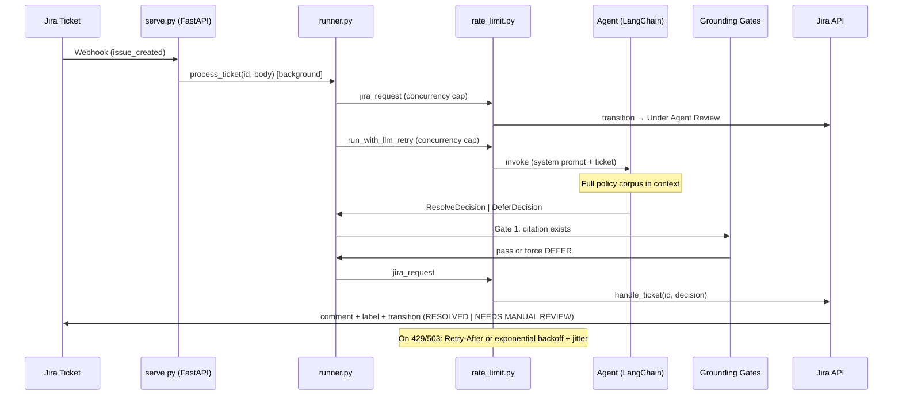
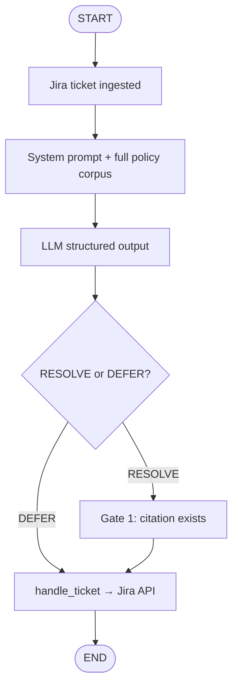

# IT Help Desk Agent

## 1. Project Overview

This agent resolves IT Help Desk tickets stored in a Jira Kanban board. To resolve a ticket, it references a fixed set of Helix IT policies. If it cannot answer from those policies with full confidence, it defers the ticket to a human with a standardized reason code.

The LLM triages each ticket by returning a **structured decision** (`ResolveDecision` or `DeferDecision`). It does **not** call Jira directly. Application code in `runner.py` applies the decision after grounding gates — keeping side effects deterministic and separate from the model loop.

## 2. Architecture

### 2.1 Overview

| Layer | Module | Role |
|-------|--------|------|
| Prompt | `prompt.py` | Full policy corpus in system prompt + triage rules |
| Agent | `agent.py` | LangChain agent with structured JSON output |
| Runner | `runner.py` | Orchestrates triage → grounding gates → Jira |
| Grounding | `grounding.py` | Gate 1: verify cited clauses exist |
| Models | `models.py` | Pydantic RESOLVE/DEFER contract, citations, comment formatting |
| Policies | `policies/` | `policies.yaml` + retriever interface (full-corpus baseline) |
| Jira | `tools.py` | `handle_ticket(id, decision)` — comment, label, transition |
| Rate limits | `rate_limit.py` | Concurrency caps + retry/backoff for Gemini and Jira REST |
| Webhook | `serve.py` | FastAPI listener — Jira `issue_created` → `process_ticket` |
| Eval | `eval/` | 50-ticket harness + CSV metrics |

The agent uses a **full-corpus grounding strategy**: all 60 policy clauses (~2.8k tokens) are rendered into the system prompt. At this corpus size, retrieval recall beats top-k RAG; the `PolicyRetrieverInterface` seam allows a vector/hybrid retriever later without changing the runner.

### 2.2 Sequence Diagram



### 2.3 Decision Flow



### 2.4 Webhook concurrency

Each `issue_created` webhook returns **200 immediately** and runs `process_ticket` in a FastAPI background task. Many webhooks at once (e.g. bulk seeding) can queue dozens of background threads; `rate_limit.py` caps how many Gemini and Jira calls run in parallel regardless of thread-pool size (see §7).

### 2.5 Python Dependencies (Direct)

| Name | Tag | Reason |
|------|-----|--------|
| LangChain | `langchain` | Agent with structured output |
| Pydantic | `pydantic` | RESOLVE/DEFER decision models |
| python-dotenv | `python-dotenv` | Environment configuration |
| FastAPI + Uvicorn | `fastapi`, `uvicorn` | Jira webhook service |
| requests | (via LangChain deps) | Jira REST API calls |

## 3. Configuration

Copy `.env.example` to `.env` and fill in values.

| Variable | Required | Purpose |
|----------|----------|---------|
| `MODEL` | Yes | LangChain model id (e.g. `google_genai:gemini-2.5-flash`, `ollama:qwen2.5:7b`) |
| `GOOGLE_API_KEY` | For Gemini | API key from [Google AI Studio](https://aistudio.google.com/apikey) |
| `JIRA_DOMAIN` | Yes | Atlassian site subdomain (e.g. `mondalalex`) |
| `JIRA_EMAIL` | Yes | Jira account email |
| `JIRA_API_TOKEN` | Yes | Atlassian API token |
| `JIRA_PROJECT_KEY` | Seed script | Jira project key (e.g. `BTS`) |
| `JIRA_ISSUE_TYPE` | Seed script | Issue type name (default `Task`) |
| `IN_REVIEW_COLUMN_STATUS` | Yes | Jira status while agent triages (e.g. `Under Agent Review`) |
| `DEFER_COLUMN_STATUS` | Yes | Jira status for deferred tickets (e.g. `NEEDS MANUAL REVIEW`) |
| `RESOLVED_COLUMN_STATUS` | Yes | Jira status for resolved tickets (e.g. `RESOLVED`) |
| `JIRA_WEBHOOK_SECRET` | No | HMAC secret from Jira webhook settings; verified via `X-Hub-Signature` |
| `WEBHOOK_PORT` | No | Local port for `serve.py` (default `8000`) |
| `WEBHOOK_PUBLIC_URL` | Dev | Public HTTPS base URL for webhooks (ngrok free static domain) |

Status names in `.env` are matched **case-insensitively** against Jira transition targets (`tools._find_transition_id`).

Optional rate-limit guards (see §7 and `rate_limit.py`; defaults shown):

| Variable | Default | Purpose |
|----------|---------|---------|
| `LLM_MAX_CONCURRENT` | `2` | Cap parallel Gemini calls (RPM/TPM protection) |
| `JIRA_MAX_CONCURRENT` | `3` | Cap parallel Jira REST calls (tenant burst limits) |
| `API_RETRY_MAX_ATTEMPTS` | `5` | Retries on transient 429/503 |
| `API_RETRY_INITIAL_DELAY` | `1.0` | Exponential backoff start (seconds) |
| `API_RETRY_MAX_DELAY` | `60.0` | Backoff ceiling (seconds) |

## 4. Running

### Install

```bash
uv sync
```

### Local dev with ngrok (deterministic URL)

Jira Cloud requires a public HTTPS URL. Use ngrok's **free static domain** so the URL stays the same every run.

**One-time setup:**

1. Sign up at [ngrok](https://ngrok.com/) and claim a free static domain at [dashboard.ngrok.com/domains](https://dashboard.ngrok.com/domains) (e.g. `your-name.ngrok-free.app`).
2. Add your authtoken: `ngrok config add-authtoken <token>` ([get token](https://dashboard.ngrok.com/get-started/your-authtoken)).
3. Install ngrok: `brew install ngrok/ngrok/ngrok`
4. Set in `.env`:
   ```
   WEBHOOK_PORT=8000
   WEBHOOK_PUBLIC_URL=https://your-name.ngrok-free.app
   ```
5. In Jira (**Settings → System → WebHooks**), set URL to:
   ```
   https://your-name.ngrok-free.app/rest/webhooks/jira
   ```

**Every dev session:**

```bash
chmod +x scripts/dev.sh   # once
./scripts/dev.sh
```

This starts uvicorn locally and tunnels it to `WEBHOOK_PUBLIC_URL`. The script prints the exact Jira webhook URL on startup.

### Webhook service (production path)

```bash
uv run uvicorn serve:app --host 0.0.0.0 --port 8000
```

Endpoints:

| Method | Path | Purpose |
|--------|------|---------|
| `GET` | `/health` | Liveness check |
| `POST` | `/rest/webhooks/jira` | Jira `jira:issue_created` webhook |

Configure a Jira webhook (Settings → System → WebHooks) pointing at `$WEBHOOK_PUBLIC_URL/rest/webhooks/jira` (see **Local dev with ngrok** above) for **Issue created** events.

Optional: set `JIRA_WEBHOOK_SECRET` in Jira (**Settings → System → WebHooks → Secret**)
and the same value in `.env`. Jira signs each delivery with `X-Hub-Signature: sha256=...`.

### Manual / script triage

```python
from runner import process_ticket

result = process_ticket("HELIX-123", "How many vacation days do I have?")
print(result.final_decision)
```

### Evaluation harness

```bash
uv run python -m eval.run_eval --output eval/results.csv
```

Runs all 50 assignment tickets (no Jira writes — uses `triage_ticket` internally via the runner's agent path). Options: `--limit N`, `--ids T-001,T-026`.

### Bulk-load eval tickets into Jira

Disable the Jira webhook first so new issues are not auto-triaged.

Set `JIRA_PROJECT_KEY` in `.env` (and optionally `JIRA_ISSUE_TYPE`, default `Task`).

```bash
# Preview
uv run python scripts/jira_eval_tickets.py seed --dry-run

# Create all 50 tickets (labels: eval-seed, t-001, …)
uv run python scripts/jira_eval_tickets.py seed

# Smoke test with 3 tickets
uv run python scripts/jira_eval_tickets.py seed --limit 3
```

The script writes `eval/seeded_jira_issues.json` with eval id → issue key mappings.

Remove seeded tickets:

```bash
uv run python scripts/jira_eval_tickets.py delete --dry-run
uv run python scripts/jira_eval_tickets.py delete --yes
```

Delete uses the manifest by default; pass `--ignore-manifest` to find issues by the `eval-seed` label instead.

## 5. Prompt Strategy

The system prompt has two parts:

1. **Knowledge base** — all 10 policies / 60 clauses rendered with exact citation ids (`POL-01 §1.4`). The model must copy citations verbatim; no prior knowledge allowed.
2. **Triage instructions** — when to RESOLVE vs DEFER, all 12 defer reason codes, and critical judgment rules (active incidents, prompt injection, privileged access, etc.).

The user message is the ticket body text (summary + description from the Jira webhook).

The agent returns a discriminated union:
- **RESOLVE** — `action`, `answer`, `citations` (required, min 1)
- **DEFER** — `action`, `answer`, `reason_code`, optional `citations`

## 6. Grounding

Grounding is enforced in layers:

| Layer | Status | Mechanism |
|-------|--------|-----------|
| Prompt | Done | "Only use Knowledge base"; defer when unsure |
| Full corpus | Done | All clauses always in context |
| Pydantic schema | Done | Invalid RESOLVE/DEFER combinations rejected at parse time |
| Gate 1: citation exists | Done | `get_section()` lookup before Jira write; fail closed to DEFER |
| Gate 2: faithfulness | Deferred | Optional LLM entailment check — add if eval shows false RESOLVEs |

Jira writes happen only in `runner.process_ticket` → `handle_ticket`, never inside the LLM loop.

## 7. Rate limit strategy

Bulk webhooks or seed scripts can enqueue many tickets at once. Without guards, Starlette's default thread pool (40 workers) would fan out parallel Gemini and Jira calls and hit provider limits quickly. `rate_limit.py` applies a **two-part strategy**: cap concurrency, then retry transient failures.

### 7.1 Gemini ([rate limits](https://ai.google.dev/gemini-api/docs/rate-limits))

Google enforces **RPM**, **TPM**, and **RPD** per project; exceeding any dimension returns **429 `RESOURCE_EXHAUSTED`**. The [troubleshooting guide](https://ai.google.dev/gemini-api/docs/troubleshooting) recommends exponential backoff with jitter on transient errors — the official Gen AI SDK uses ~5 attempts, 1s initial delay, 60s max.

**Our approach (`run_with_llm_retry` in `runner.py`):**

- **`LLM_MAX_CONCURRENT` (default 2)** — limits in-flight `AGENT.invoke` calls. This is a conservative heuristic to reduce RPM/TPM bursts during webhook storms; it is not a published Google quota value. Tune against your tier in [AI Studio](https://aistudio.google.com/).
- **Retry** — up to `API_RETRY_MAX_ATTEMPTS` on 429/503-style errors with exponential backoff + jitter.

### 7.2 Jira ([Atlassian guidance](https://www.atlassian.com/blog/development/api-rate-limit-handling-for-apps))

Jira Cloud throttles by **tenant concurrent load**. Responses may include **429** or **503** and optionally a **`Retry-After`** header (or `Beta-Retry-After`). Atlassian recommends honoring that header, otherwise exponential backoff + jitter.

**Our approach (`jira_request` in `tools.py`, also used by the seed script):**

- **`JIRA_MAX_CONCURRENT` (default 3)** — limits parallel REST calls across transitions, comments, labels, and search. Another conservative heuristic aligned with Atlassian's advice to keep concurrency low on longer requests.
- **Retry** — 429, 408, 503; uses `Retry-After` when present, else exponential backoff + jitter (same env vars as Gemini retries).

### 7.3 Defaults and tuning

| Variable | Default | Role |
|----------|---------|------|
| `LLM_MAX_CONCURRENT` | `2` | Max parallel Gemini invocations |
| `JIRA_MAX_CONCURRENT` | `3` | Max parallel Jira REST calls |
| `API_RETRY_MAX_ATTEMPTS` | `5` | Retry budget per call |
| `API_RETRY_INITIAL_DELAY` | `1.0` | Backoff start (seconds) |
| `API_RETRY_MAX_DELAY` | `60.0` | Backoff ceiling (seconds) |

If logs still show 429s after retries, lower concurrency. If throughput is safe and logs are clean, raise caps gradually. Daily Gemini quota exhaustion (RPD) will not recover until the reset window — retries cannot fix that.

## 8. Evaluation

The eval set (`tests/fixtures/eval_tickets.py`) contains all 50 assignment tickets with ground-truth RESOLVE citations and DEFER reason codes.

Metrics (`eval/metrics.py`):

- **RESOLVE accuracy** — correct action + expected citations present
- **DEFER accuracy** — correct action + reason code match
- **Weighted errors** — missed RESOLVE + 3× false RESOLVE (per assignment rubric)

Run locally and inspect `eval/results.csv` for per-ticket agent vs final (post-gate) columns.

## 9. Production hardening (deferred)

Items intentionally out of scope for the take-home demo but worth doing before a real rollout:

| Item | Effort | Notes |
|------|--------|-------|
| **Dedicated bot Jira account** | ~10 min setup, 0 code | Create an Atlassian user named “IT Help Desk Agent”, invite it to the site, use its API token for `JIRA_EMAIL`. Jira attributes REST comments to the authenticated user — there is no per-comment author override. |
| **Assign deferred tickets to a human** | ~20–30 min | One `PUT /rest/api/3/issue/{key}` with `fields.assignee.accountId` in `handle_ticket`, gated by optional `JIRA_ASSIGNEE_ACCOUNT_ID` in `.env`. Typically assign on **DEFER** only (manual review queue); auto-**RESOLVE** tickets usually stay unassigned. |
| **Gate 2: faithfulness check** | ~2–4 hrs | LLM entailment pass before RESOLVE writes (see §6). |
| **Webhook idempotency + retries** | ~1–2 hrs | Dedupe by issue key + event id; retry failed background triage. |

To find your Atlassian `accountId` for assignment: **Profile → … → Copy account ID**, or `GET /rest/api/3/myself` with your API token.

## 10. Useful Links

- [Gemini API pricing](https://ai.google.dev/gemini-api/docs/pricing)
- [Gemini API rate limits](https://ai.google.dev/gemini-api/docs/rate-limits)
- [Jira API rate limit handling](https://www.atlassian.com/blog/development/api-rate-limit-handling-for-apps)
- Mermaid Charts in Markdown: https://www.markdownlang.com/advanced/diagrams.html
