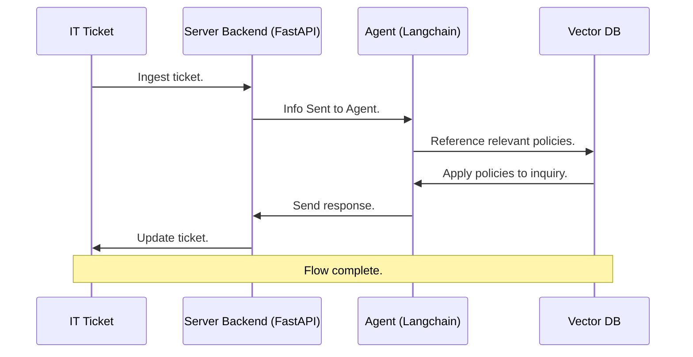

# IT Help Desk Agent

## 1. Project Overview

This agent resolves IT Help Desk Tickets stored in a Jira Kanban board. To resolve a ticket, the agent references a set of policies. If the agent cannot find a relevant policy to resolve the ticket with 100% certainty, it marks the ticket for human review.

The agent is powered by AI and is built following the ReACT framework (Reasoning and Action). First, it reasons in a chain-of-thought style. Second, it decides if it needs to take an action (seaching for a policy or a tool call). It proceeds in this loop until it reaches a conclusion.

## 2. Architecture

### 2.1 Overview

The AI agent itself is implemented using LangChain. It has a set of tools that use the Atlassian API to interact with the Jira board. It uses a vector store with metadata to retrieve relevant policies to the inquiry. It's prompt is engineered to safeguard against uncertainty.

The agent runs inside of a FastAPI server. The server listens to a Jira Webhook to check if a new ticket was posed to the IT Help Desk Jira board. If a ticket is posted, the agent ingests, evaluates and acts on the ticket.

### 2.2 Mermaid Diagrams

### 2.2.1 High-Level Sequence Diagram




### 2.2.2 Detailed Flow Chart

```mermaid
flowchart LR
    S([START]) --> A[Jira Ticket]
    A --> B[Webhook]
    B --> C[FastAPI]
    C --> D[Listener]
    D --> E[Prompt]
    E --> F[Agent]
    F --> H[POST Changes]
    H --> A

flowchart LR
    F[Agent] --> G[CoT]
    G --> H[Policy Retrieval]
    H --> K[(Vector DB)]
    K --> H
    H --> G
    G --> I[Edit Ticket]
    I --> M[Jira API]
    M --> I
    I --> J([END])
```


### 2.3 Python Dependencies (Direct)

| Name | Tag | Reason |
|------|-----|--------|
| Langchain | `langchain` | Agent development and deployment |
| FastAPI   | `fastapi` | Serve the agent and listen to Jira webhooks |
| Jira | `jira` | Resolve, label and comment on tickets in the Jira board |


## 3. Prompt Strategy

## 4. Grounding

## 5. Evaluation:

1. Correctness - Does the agent resolve the right tickets, and leave the right ones alone?
2. Grounding - Are answers traceable to a specific policy section, or does it hallucinate?
3. Judgement - Does it recognize when a ticket is out of scope, ambiguous or sensitive?


## 6. Useful Links

- Mermaid Charts in Markdown: https://www.markdownlang.com/advanced/diagrams.html
