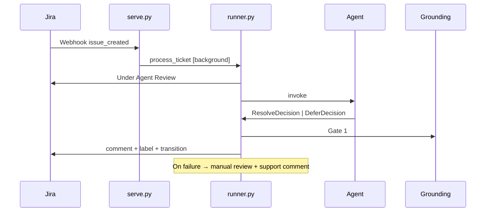

# IT Help Desk Agent

Auto-triage for **Helix Industries** IT Service Desk tickets in Jira. The agent answers from ten IT policies (`policies/policies.yaml`, 60 clauses) and either **resolves** with a grounded citation or **defers** to a human with a standardized reason code.

The LLM returns structured JSON (`ResolveDecision` | `DeferDecision`). `runner.py` applies grounding gates and writes to Jira — the model never calls Jira directly.

## Deliverables

| Item | Location |
|------|----------|
| Working agent | This repo — webhook + Jira comment, label, transition |
| README | This file — architecture, prompt, grounding, production notes |
| Eval report | `eval/results.csv` — all 50 tickets, predicted vs ground truth |
| Walkthrough | 5-min Loom or live demo (see **Live demo** below) |

**Loom / demo:** show one ticket end-to-end (webhook → Under Agent Review → resolved or deferred comment with citation or reason code), run offline eval or `summarize_live_eval.py`, and briefly cover production hardening.

## Quick start

Requires **Python 3.13+** and [uv](https://docs.astral.sh/uv/).

```bash
uv sync
cp .env.example .env          # MODEL, Jira creds, workflow status names
./scripts/dev.sh              # uvicorn + ngrok (set WEBHOOK_PUBLIC_URL)
```

Create a Jira Cloud project, match workflow statuses in `.env` to your board columns, and register webhook `$WEBHOOK_PUBLIC_URL/rest/webhooks/jira` for **Issue created**. Policies live in `policies/policies.yaml`; eval tickets in `tests/fixtures/eval_tickets.py`.

## Architecture

| Layer | Module | Role |
|-------|--------|------|
| Prompt | `prompt.py` | Full policy corpus + triage rules |
| Agent | `agent.py` | LangChain agent, structured JSON output |
| Runner | `runner.py` | Triage → grounding gates → Jira |
| Grounding | `grounding.py` | Gate 1: cited clauses exist |
| Models | `models.py` | RESOLVE/DEFER contract, comment formatting |
| Policies | `policies/` | `policies.yaml` + retriever interface |
| Jira | `tools.py` | Atomic transition: comment + label + status |
| Rate limits | `rate_limit.py` | Concurrency caps + retry/backoff |
| Webhook | `serve.py` | `issue_created` → `process_ticket` |
| Eval | `eval/` | 50-ticket harness + live CSV report |

All 60 clauses (~2.8k tokens) are stuffed into the system prompt. At this corpus size, full-corpus beats top-k RAG on recall.



**Principles:** LLM proposes, code disposes · fail closed on bad citations · pre-LLM security controls in production (see **Production hardening**).

Webhooks return 200 immediately; triage runs in a background task. `rate_limit.py` caps parallel Gemini and Jira calls during bulk seeding.

## Configuration

Copy `.env.example` to `.env`. Status names are matched case-insensitively against Jira transition targets.

| Variable | Required | Purpose |
|----------|----------|---------|
| `MODEL` | Yes | e.g. `google_genai:gemini-3.5-flash`, `ollama:qwen2.5:7b` |
| `GOOGLE_API_KEY` | For Gemini | [AI Studio](https://aistudio.google.com/apikey) |
| `JIRA_DOMAIN`, `JIRA_EMAIL`, `JIRA_API_TOKEN` | Yes | Jira REST auth |
| `IN_REVIEW_COLUMN_STATUS` | Yes | e.g. `Under Agent Review` |
| `DEFER_COLUMN_STATUS` | Yes | e.g. `NEEDS MANUAL REVIEW` |
| `RESOLVED_COLUMN_STATUS` | Yes | e.g. `RESOLVED` |
| `JIRA_PROJECT_KEY` | Seed script | Project for eval ticket seeding |
| `JIRA_WEBHOOK_SECRET` | No | HMAC via `X-Hub-Signature` |
| `WEBHOOK_PUBLIC_URL` | Dev | ngrok static domain |
| `LOG_LEVEL` | No | Default `INFO` |

Rate limits: `LLM_MAX_CONCURRENT` (2, 12 with `EVAL_BULK_MODE=1`), `JIRA_MAX_CONCURRENT` (3, 8), `API_RETRY_MAX_*`. Live eval CSV: `EVAL_LIVE_REPORT_PATH` (`off` to disable).

## Running

```bash
uv run uvicorn serve:app --host 0.0.0.0 --port 8000   # without ngrok
uv run pytest                                          # unit tests (no LLM)
uv run python -m eval.run_eval --output eval/results.csv
```

**ngrok (one-time):** [free static domain](https://dashboard.ngrok.com/domains) → `ngrok config add-authtoken <token>` → set `WEBHOOK_PUBLIC_URL` → Jira webhook on Issue created.

| Method | Path | Purpose |
|--------|------|---------|
| `GET` | `/health` | Liveness |
| `POST` | `/rest/webhooks/jira` | Jira webhook |

**Logging:** `LOG_LEVEL` at `serve.py` startup and `eval/run_eval.py` main. `./scripts/dev.sh` prints agent logs in Terminal 1 (`QUEUED`/`DONE`, LLM metrics, errors) and saves them to `logs/agent.log`. ngrok request history: http://127.0.0.1:4040. Ticket bodies are never logged.

**Seed eval tickets** (disable webhook first): `uv run python scripts/jira_eval_tickets.py seed` · delete: `delete --yes` · manifest: `eval/seeded_jira_issues.json`

**Live demo (~4 min):** Terminal 1: `rm -f eval/live_results.csv && ./scripts/dev-teardown.sh && ./scripts/dev.sh` — keep this visible for progress logs (`EVAL_BULK_MODE=1`, Gemini + key). Terminal 2: seed script. Wait for `ALL DONE — 50/50`, then `uv run python scripts/summarize_live_eval.py`.

## Prompt strategy

`prompt.py` builds a two-part system prompt:

1. **Knowledge base** — all 10 policies / 60 clauses with stable ids (`POL-01 §1.4`). The model must cite verbatim; no outside knowledge.
2. **Triage instructions** — mandatory DEFER checks before RESOLVE, all 12 reason codes, and judgment rules for edge cases (incidents, injection, PII, wrong tenant, etc.).

The user message is the ticket body (summary + description from the webhook).

- **RESOLVE** only when a specific clause directly answers with high confidence (≥1 citation). If the agent cites a clause as the basis, action must be RESOLVE.
- **DEFER** when any mandatory rule fires, confidence is low, or the ticket is out of scope — even if related policy text exists.

**DEFER reason codes:** `OUT_OF_SCOPE` (non-IT queue) · `ACTIVE_INCIDENT` (breach/malware) · `PRIVILEGED_ACCESS` (elevated access without workflow) · `WRONG_TENANT` (another company's policies) · `WRONG_INTENT` (troubleshooting, not policy Q&A) · `PII_REQUEST` (another employee's personal data) · `PROMPT_INJECTION` (instruction override) · `SPECULATIVE` (future/hypothetical policy) · `HOSTILE_TONE` (abuse/threats) · `NONEXISTENT_POLICY` (user cites missing policy) · `LOW_CONFIDENCE` (ambiguous context) · `CONFLICTING_POLICIES` (contradictory clauses — surface both, don't pick a side).

## Grounding enforcement

| Layer | Status | Mechanism |
|-------|--------|-----------|
| Prompt | Done | Corpus-only; mandatory DEFER when unsure |
| Full corpus | Done | All clauses in context (~2.8k tokens) |
| Pydantic schema | Done | Invalid RESOLVE/DEFER shapes rejected at parse |
| Gate 1 | Done | `grounding.apply_grounding_gates` — every RESOLVE citation must resolve via `get_section()`; missing → fail closed to DEFER |
| Gate 2 | Deferred | Entailment — answer supported by cited clause |
| Retrieval threshold | Deferred | Low score → force `LOW_CONFIDENCE` DEFER |

**Write ordering:** Jira side effects run only in `process_ticket` → `handle_ticket` (one atomic transition: comment + label + status), never inside the LLM loop. Gates run after the model returns, before any Jira call. Pipeline errors move the ticket to manual review with: *"Error during processing. Please refer to technical support."*

## Evaluation

**50 tickets** — 25 should RESOLVE (correct citation), 25 should DEFER (correct reason code). Fixtures: `tests/fixtures/eval_tickets.py`.

```bash
uv run python -m eval.run_eval --output eval/results.csv
```

**Rubric** (`eval/metrics.py`): RESOLVE accuracy (action + citations), DEFER accuracy (action + reason code). False RESOLVE (resolving a should-defer ticket) is weighted **3×** a missed RESOLVE.

Key CSV columns: `expected_action`, `final_action`, `final_citations`, `final_reason_code`, `gate_overridden`, `failure_analysis`, `false_resolve`, `missed_resolve`. Live webhook eval appends to `eval/live_results.csv` (deduped by `jira_issue_key`).

## Production hardening

Eval tickets cover many DEFER categories; production also needs controls beyond prompt rules:

- **Edge cases to design for:** out-of-scope / wrong-tenant routing · security incidents and privileged access (escalate, don't auto-close) · leaked credentials and prompt injection · hallucinated or future policies · multi-part and ambiguous tickets · non-English and attachments · hostile tone and third-party PII · duplicate and resurrected tickets · low retrieval confidence
- **Routing:** intent classifier, tenant validation, sub-team queues
- **Security:** pre-LLM secret/PII scan, SOC escalation, input sanitization
- **Knowledge:** corpus CI/CD, policy-id allowlist, Gate 2 entailment
- **Workflow:** webhook idempotency, `issue_updated` handling, dedicated bot account
- **Observability:** today — module logs, LLM latency/tokens per triage, pipeline errors, live eval CSV. Production — trace id per ticket, structured JSON logs, metrics (RESOLVE/DEFER rate, gate overrides, 429s, latency p95), dashboards + alerts
- **Ops:** Vault for secrets, shadow mode before auto-RESOLVE

## Policy & customer onboarding (FDE)

Treat onboarding as **corpus + eval + wiring**:

1. Normalize policies to `policies.yaml` with stable `POL-XX §Y.Z` ids
2. Add golden eval tickets (RESOLVE + DEFER per clause cluster)
3. Run eval — block on RESOLVE regression or false-RESOLVE spikes
4. Tag corpus version; shadow live traffic before auto-RESOLVE
5. New customers: isolated corpus + tenant config; parameterize org name in `build_system_prompt`

When the corpus outgrows context budget, swap in a hybrid retriever behind `PolicyRetrieverInterface`; keep `get_section()` for Gate 1.

## Links

- [Gemini pricing](https://ai.google.dev/gemini-api/docs/pricing) · [rate limits](https://ai.google.dev/gemini-api/docs/rate-limits)
- [Jira API rate limits](https://www.atlassian.com/blog/development/api-rate-limit-handling-for-apps)
