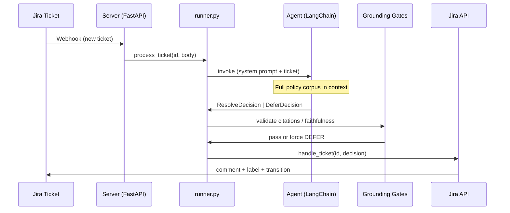
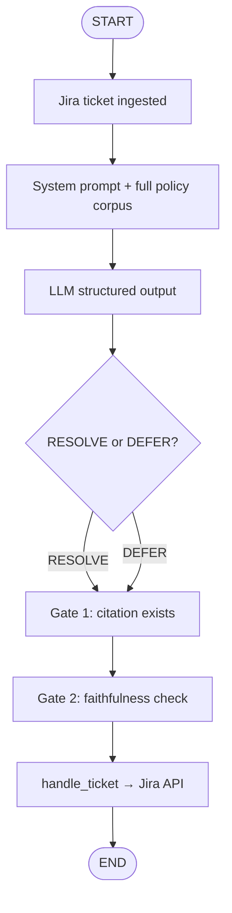

# IT Help Desk Agent

## 1. Project Overview

This agent resolves IT Help Desk tickets stored in a Jira Kanban board. To resolve a ticket, it references a fixed set of Helix IT policies. If it cannot answer from those policies with full confidence, it defers the ticket to a human with a standardized reason code.

The LLM triages each ticket by returning a **structured decision** (`ResolveDecision` or `DeferDecision`). It does **not** call Jira directly. Application code in `runner.py` applies the decision after validation — keeping side effects deterministic and leaving room for grounding gates before anything is posted.

## 2. Architecture

### 2.1 Overview

| Layer | Module | Role |
|-------|--------|------|
| Prompt | `prompt.py` | Full policy corpus in system prompt + triage rules |
| Agent | `agent.py` | LangChain agent with `response_format=DecisionUnion` (no tools) |
| Runner | `runner.py` | Orchestrates triage → validation → Jira |
| Models | `models.py` | Pydantic RESOLVE/DEFER contract, citations, comment formatting |
| Policies | `policies/` | `policies.yaml` + retriever interface (full-corpus baseline) |
| Jira | `tools.py` | `handle_ticket(id, decision)` — comment, label, transition |

The agent uses a **full-corpus grounding strategy**: all 60 policy clauses (~2.8k tokens) are rendered into the system prompt. At this corpus size, retrieval recall beats top-k RAG; the `PolicyRetrieverInterface` seam allows a vector/hybrid retriever later without changing the runner.

A FastAPI webhook listener (`serve.py`, planned) will receive new Jira tickets and call `runner.process_ticket`.

### 2.2 Sequence Diagram

### 2.3 Decision Flow

### 2.4 Python Dependencies (Direct)

| Name | Tag | Reason |
|------|-----|--------|
| LangChain | `langchain` | Agent with structured output |
| Pydantic | `pydantic` | RESOLVE/DEFER decision models |
| python-dotenv | `python-dotenv` | Environment configuration |
| requests | (via LangChain deps) | Jira REST API calls |

## 3. Prompt Strategy

The system prompt has two parts:

1. **Knowledge base** — all 10 policies / 60 clauses rendered with exact citation ids (`POL-01 §1.4`). The model must copy citations verbatim; no prior knowledge allowed.
2. **Triage instructions** — when to RESOLVE vs DEFER, all 12 defer reason codes, and critical judgment rules (active incidents, prompt injection, privileged access, etc.).

The user message is the ticket body text.

The agent returns a discriminated union:
- **RESOLVE** — `action`, `answer`, `citations` (required, min 1)
- **DEFER** — `action`, `answer`, `reason_code`, optional `citations`

## 4. Grounding

Grounding is enforced in layers:

| Layer | Status | Mechanism |
|-------|--------|-----------|
| Prompt | Done | "Only use Knowledge base"; defer when unsure |
| Full corpus | Done | All clauses always in context |
| Pydantic schema | Done | Invalid RESOLVE/DEFER combinations rejected at parse time |
| Gate 1: citation exists | Planned | `get_section()` lookup before Jira write |
| Gate 2: faithfulness | Planned | Verify answer is entailed by cited clause text |

Jira writes happen only in `runner.process_ticket` → `handle_ticket`, never inside the LLM loop. This keeps grounding gates fail-closed: a bad RESOLVE is blocked before it reaches the board.

## 5. Evaluation

1. **Correctness** — Does the agent resolve the right tickets and defer the right ones?
2. **Grounding** — Are answers traceable to a specific policy section?
3. **Judgement** — Does it recognize out-of-scope, ambiguous, or sensitive tickets?

*(Eval harness over the 50 assignment tickets — planned.)*

## 6. Useful Links

- Mermaid Charts in Markdown: https://www.markdownlang.com/advanced/diagrams.html
